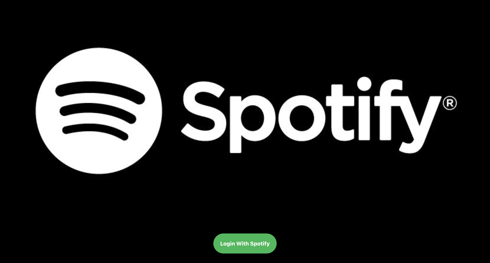
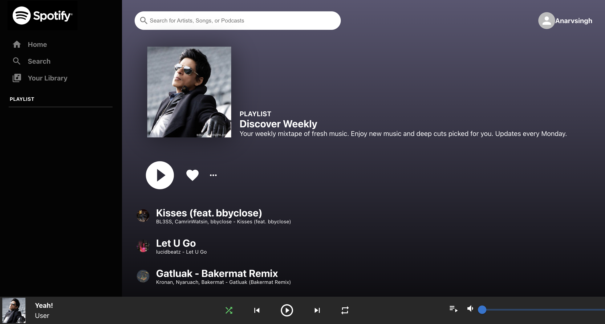
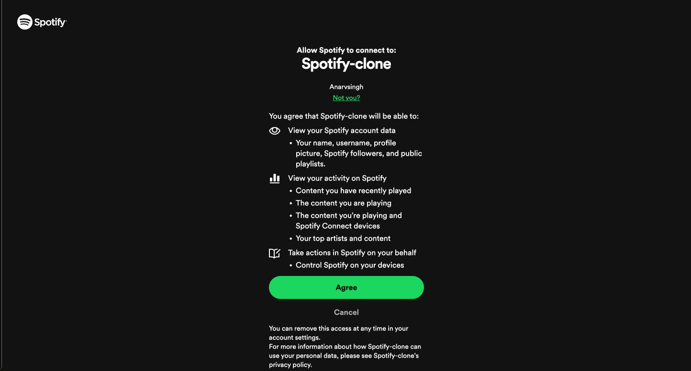
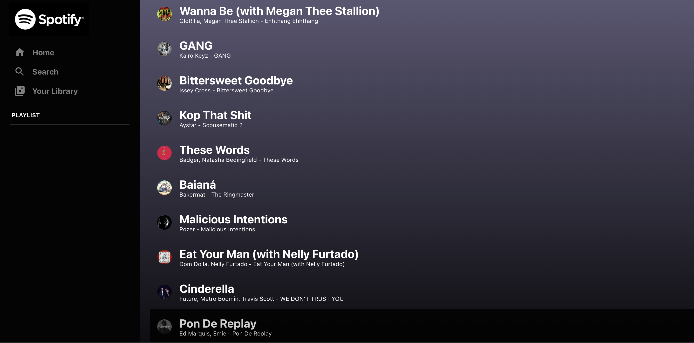

This project is a simplified version of Spotify, a popular music streaming platform. It allows users to explore and listen to a variety of music tracks.

Key Features:

Music Library: Access a vast library of songs and albums.
User Authentication: Securely log in and create user accounts.
Music Playback: Play, pause, and skip tracks seamlessly.
Playlist Creation: Create and manage personal playlists.
Search Functionality: Search for specific artists, albums, or songs.
Technology Stack:

Frontend: React JS for building the user interface.
Backend: Node.js and Express.js for server-side logic and API endpoints.
Database: MongoDB to store user data, music metadata, and playlist information.
Music Streaming: Utilize a streaming service like Spotify's Web API or a similar service to access music content.

